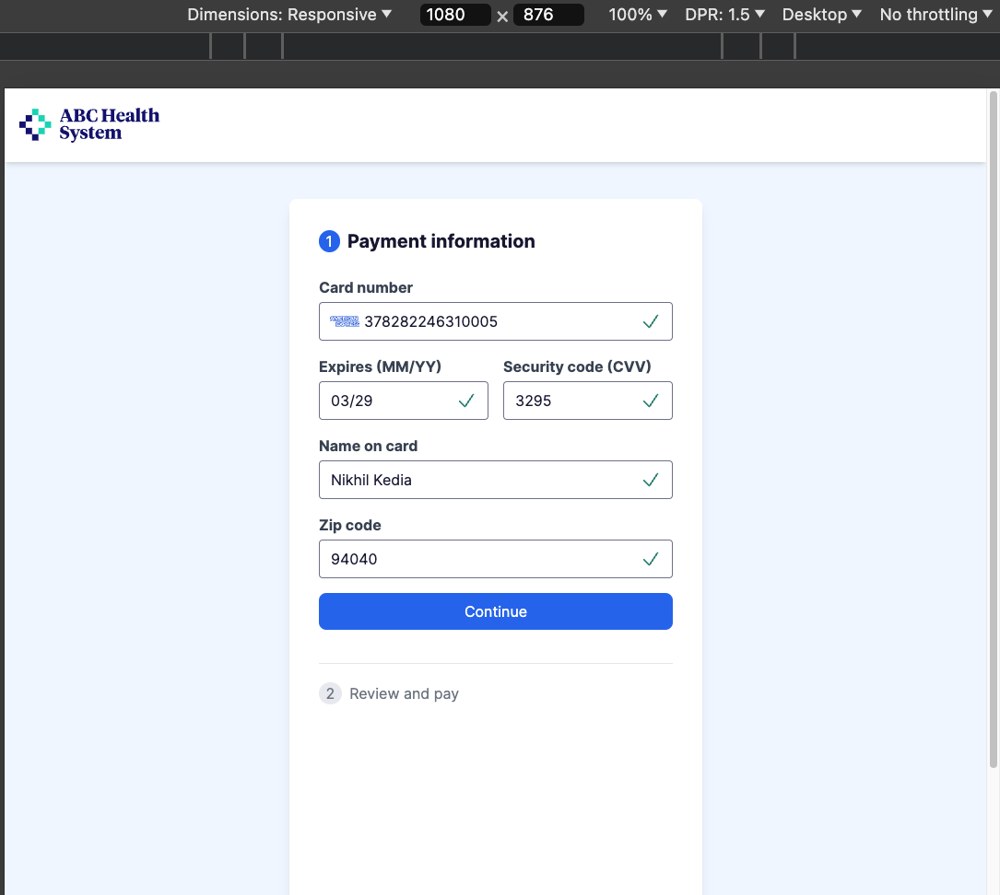

# Simple Payment Flow



Made with **Next.js**, **TypeScript**, **Tailwind CSS**, & **Validator API**.

Test the app with these [Test Credit Card Numbers](https://www.paypalobjects.com/en_GB/vhelp/paypalmanager_help/credit_card_numbers.htm).

### Screenshot Legend:
- **lg:** 1024px
- **md:** 768px
- **xs:** 375px

---

## Table of Contents
- [Simple Payment Flow](#simple-payment-flow)
    - [Screenshot Legend:](#screenshot-legend)
  - [Table of Contents](#table-of-contents)
  - [Overview](#overview)
  - [Pages](#pages)
    - [Home/Welcome Page (`/app/page.tsx`)](#homewelcome-page-apppagetsx)
    - [PayAndReview Page (`/app/PayAndReview/page.tsx`)](#payandreview-page-apppayandreviewpagetsx)
    - [Thank You Page (`/app/ThankYou/page.tsx`)](#thank-you-page-appthankyoupagetsx)
  - [Components (/app/components)](#components-appcomponents)
    - [Icons Component (`/app/components/Icons.tsx`)](#icons-component-appcomponentsiconstsx)
    - [ErrorText Component (`/app/components/ErrorText.tsx`)](#errortext-component-appcomponentserrortexttsx)
    - [InputField Component (`/app/components/InputField.tsx`)](#inputfield-component-appcomponentsinputfieldtsx)
      - [Properties:](#properties)
    - [PaymentForm Component (`/app/components/PaymentForm.tsx`)](#paymentform-component-appcomponentspaymentformtsx)
      - [Validation Logic:](#validation-logic)
  - [Getting Started](#getting-started)
    - [Running the Development Server:](#running-the-development-server)
    - [Updated to Use Next.js Routing:](#updated-to-use-nextjs-routing)

---

## Overview

The **Simple Payment Flow** app streamlines the payment process for medical bills. It starts with a combined **Home/Welcome Page** that displays an introduction and the total amount due. The flow then continues to the **PayAndReview Page**, where users can review and submit their payment, followed by a confirmation on the **Thank You Page**.

The application leverages **Next.js** routing to navigate between stages and uses **AppContext** for managing the global state, such as payment details, editing status, and card information.

---

## Pages

### Home/Welcome Page (`/app/page.tsx`)

The **Home/Welcome Page** is the first page the user sees when starting the payment process. It combines the functionality of both the home and welcome pages by introducing the user and displaying a summary of their medical bills.

**Functionality:**
- Displays a welcome message, the user’s name, and the total amount due.
- Offers a "Pay total" button that directs users to the **PayAndReview Page** for completing the payment.
  
**Context:**
- **amount**: Displays the total amount due.
- **setEditing**: Function to toggle between editing and reviewing states.
  
**Event Handlers:**
- `handleContinue`: Sets the `editing` state to `true` and navigates to the **PayAndReview Page**.

---

### PayAndReview Page (`/app/PayAndReview/page.tsx`)

The **PayAndReview Page** is responsible for handling both the payment form and the review process. Users can fill out their payment details and review the information before submitting the payment.

**Functionality:**
- Displays a form for users to input payment details and a review section that shows the payment method and amount.
  
**Context:**
- **amount**: The total amount to be paid.
- **cardNumber**: The card number used for payment.
- **editing**: Boolean indicating if the user is editing the payment information.
- **setEditing**: Function to switch between editing and reviewing states.

**State:**
- **paymentFormClass**: Determines the CSS class for the payment form based on whether the user is editing.
- **reviewFragmentClass**: Determines the CSS class for the review section based on whether the user is editing.

**Event Handlers:**
- `useEffect`: Automatically sets `editing` to `true` if the user accesses the `/payandreview` route directly, ensuring the payment form is displayed.
- `handlePayment`: Submits the payment and redirects the user to the **Thank You Page** after setting `editing` to `false`.

---

### Thank You Page (`/app/ThankYou/page.tsx`)

The **Thank You Page** is the final step of the payment flow. Once the user completes their payment, they are redirected to this page, where a confirmation message is displayed.

**Functionality:**
- Displays a confirmation message to thank the user for their payment.

---

## Components (/app/components)

### Icons Component (`/app/components/Icons.tsx`)

The **Icons Component** is a flexible component that renders various icons based on the `type` prop. It can display icons for errors, success, and credit cards.

---

### ErrorText Component (`/app/components/ErrorText.tsx`)

The **ErrorText Component** displays error messages for form fields. It accepts a `type` and `id` prop to render specific error messages depending on the validation state of the fields.

---

### InputField Component (`/app/components/InputField.tsx`)

The **InputField Component** is a reusable input field that supports validation and provides feedback to users through error or success icons.

#### Properties:
- **id**: Unique identifier for the input field.
- **classes**: Optional CSS classes to style the input field.
- **label**: The label text for the input field.
- **value**: The current value of the input field.
- **onChange**: Function that handles input value changes.
- **onKeyDown**: Optional function for handling key-down events.
- **error**: Boolean indicating if there is an error with the input.
- **ariaLabel**: Provides accessibility for screen readers.
- **validationFunc**: A function to validate the input value.

---

### PaymentForm Component (`/app/components/PaymentForm.tsx`)

The **PaymentForm Component** manages the input and validation of the user's payment information. It includes validation for fields like card number, expiry date, CVV, name, and ZIP code.

#### Validation Logic:
- **Card Number**: Validated using `validator.isCreditCard`.
- **Expiry Date**: Validated using a custom function to check the MM/YY format and ensure the date is in the future.
- **CVV**: Validated as a numeric value with a length of 3 or 4 digits.
- **Name**: Validated to ensure it only contains alphabetic characters with no spaces.
- **ZIP Code**: Validated using `validator.isPostalCode` for the US.

**Event Handlers:**
- `handleFieldChange`: Manages changes to form fields and validates them.
- `handleExpiryKeyDown`: Handles key-down events to manage deletion in the expiry date input field.
- `handleSubmit`: Final form submission and validation.

---

## Getting Started

To run the project locally, follow these steps:

### Running the Development Server:

```bash
npm run next

# or

yarn next

# or

pnpm next

# or

bun next
```

Open [http://localhost:3000/cedar-payment-flow](http://localhost:3000/cedar-payment-flow) in your browser to see the result.

You can edit any page or component by modifying the corresponding files in the `/app` folder. The app will auto-update as you make changes.

This project uses [`next/font`](https://nextjs.org/docs/basic-features/font-optimization) to optimize and load the Inter font, a custom Google Font.

---

### Updated to Use Next.js Routing:
- The payment flow now uses **Next.js routing** to manage transitions between pages, simplifying the logic by removing conditional rendering.
- The global state, such as payment details and editing status, is still managed via **AppContext**, but the transition between stages (e.g., Welcome to PayAndReview) is now handled through the Next.js routing system.

---
